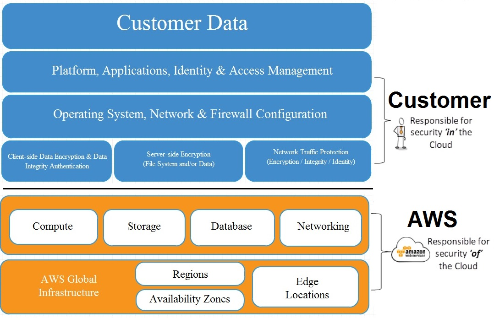

# The Well Architected Framework 

The whitepaper discussed in this section are available for download at https://aws.amazon.com/architecture/well-architected/ or in the `whitepapers` folder.

**Structure of each pillar**

* Design Principles
* Definition
* Best Practises - the most importnant part in the whitepapers
* Key AWS Services
* Resources

**General Design Principles**

- Stop guessing your capacity needs - know your traffic etc.
- Test systems at production scale - do quick test with on-demand resources
- Automate to make architectural experimentation easier - use CloudFormation as much as you can
- Allow for evolutionary architectures - allow your architecture to be dynamic
- Data-Driven architectures - log usage data to CloudWatch and take decisions from this data
- Improve through game days - test the copy of your production environment with simulations of big events like "Black Friday". Pay only for the resources

## I Security

### Design Principles

* Apply security at all layers - don't focus only on your firewall, remeber about Subnets, ACL's, Ports, Anti-Virus on Instances
* Enable traceability
* Automate responses to security events - SNS notification where port 22 is bruteforced
* Focus on securing your system
* Automate security best practises - take a default AMI and harden the OS (bullet-proof it), then use your Hardened AMI, more at https://www.cisecurity.org/services/hardened-virtual-images/

 

### Definition

Security in the cloud consists of 4 areas;

* Data protection
* Privilege management
* Infrastructure protection
* Detective controls

### Data Protection

Before you begin to architect security practices across your environment, basic data classification should be in place. You should organise and classify your data in to segments such as publicly available, available to only members of your organisation, available to only certain members of your organisation, available only to the board etc. You should also implement a least privilege access system so that people are only able to access what they need. However most importantly, you should encrypt everything where possible, whether it be at rest or in transit (https).

#### Data Protection - Best Practises

In AWS the following practices help to protect your data; 

* AWS customers maintain full control over their data. 
* AWS makes it easier for you to encrypt your data and manage keys, including regular key rotation, which can be easily automated natively by AWS or maintained by a customer. (Key Management Tools )
* Detailed logging is available that contains important content, such as file access and changes. (CloudTrail - changes in environment)
* AWS has designed storage systems for exceptional resiliency. As an example, Amazon Simple Storage Service (S3) is designed for 11 nines of durability. (For example, if you store 10,000 objects with Amazon S3, you can on average expect to incur a loss of a single object once every 10,000,000 years.)
* Versioning, which can be a part of a larger data lifecycle-management process, can protect against accidental overwrites, deletes and similar harm.
* AWS never initiates the movement of data between regions. Content placed in region will remain in that region unless the customer explicitly enables a feature or leverages a service that provides that functionality.

#### Best Practises - Data Protection Questions

- How are you encrypting and protecting your data at rest? 
- How are you encrypting and protecting your data at transit? (SSL)

### Privilege management

#### Privilege management - Best Practises

Privilege management ensures that only authorized and authenticated users are able to access your resources, and only in a manner that is intended. It can include:

* Access Control Lists (ACLs) - who can access this data?
* Role Based Access Controls - S3 Role for and EC2, lets the instance access S3 but not other services
* Password Management (such as password rotation policies)

#### Best Practises - Privilege management Questions

* How are you protecting access to and use of the AWS root account credentials?
  * MFA
* How are you defining roles and responsibilities of system users to control human access to the AWS Management Console and APIs?
  * Groups of SysAdmins, Level2Admins, HR, etc.
* How are you limiting automated access (such as from applications, scripts, or third-party tolls or services) to AWS resources?
  * DynamoDB accessec only form inside the VPC
* How are you managing keys and credentials?

### Infrastructure protection

#### Infrastructure protection - Best Practises

Outside of Cloud, this is how you protect your data centre. RFID controls, security, lockable cabinets, CCTV, etc. Within AWS they handle this, so really Infrastructure protections exists at VPC level.

#### Best Practises - Infrastructure protection Questions

* How are you enforcing network and host-level boundary protection?
  * VPC: security groups, ACLs, public/private subnets, what users do you use to login to EC2 instances, are EC2 instances in public/private subnets, do you use bastions hosts
* How are you enforcing AWS service level protection?
  * Multiple users to the console? IAM? MFA? Password policies, Different privileges
* How are you protecting the integrity of the operating systems on your Amazon EC2 instances?
  * Anti-Virus etc.

### Detective controls

#### Detective controls - Best Practises

You can use detective controls to detect or identify a security breach.

AWS Services to achieve this include:

- AWS CloudTrail - log changes in AWS environment
- Amazon CoudWatch - monitor CPU/RAM utilization etc.
- AWS Config
- Amazon Simple Storage Service (S3)
- Amazon Glacier

#### Best Practises - Detective controls Questions

- How are you capturing and analysing AWS logs?
  - is CloudTrail is on in every Region? - it's regional
  - IDS/IPS log management service; AlertLogic

### Key AWS Services

- Data protection
  - You can encrypt your data both in transit and at rest using:
    - ELB, EBS, S3 & RDS
- Privilege management
  - IAM (Identity Access Management), MFA (Multi-Factor Authentication)
- Infrastructure protection
  - VPC - think that a VPC is your private data centre
    - security groups, open/ closed ports for individual IP's
- Detective Controls
  - AWS CloudTrail
  - AWS Config
  - Amazon Cloud Watch

 

## II Reliability

## III Performance Efficiency

## IV Cost Optimazation

## V Operational Excellence

## Summary
